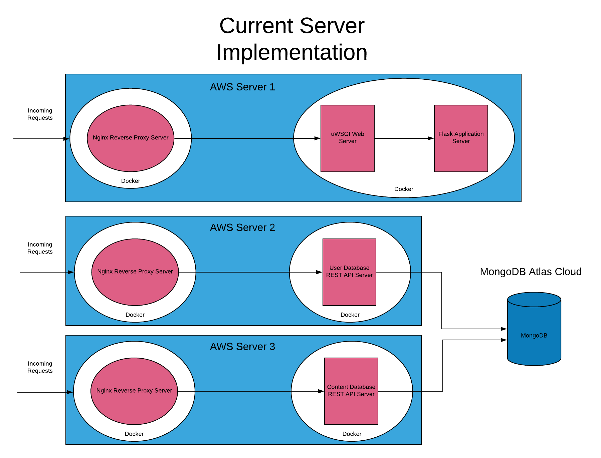

# Servers and Containerization




## Server Hosting

- Application Server -> https://ec2-18-223-101-151.us-east-2.compute.amazonaws.com
- User Database Rest API -> https://ec2-3-82-150-208.compute-1.amazonaws.com
- Content Database Rest API -> https://ec2-34-227-109-120.compute-1.amazonaws.com

## Docker 

```bash
sudo apt-get remove docker docker-engine docker.io containerd runc

sudo apt-get update

sudo apt-get install \
    apt-transport-https \
    ca-certificates \
    curl \
    gnupg-agent \
    software-properties-common

curl -fsSL https://download.docker.com/linux/ubuntu/gpg | sudo apt-key add -

sudo add-apt-repository \
   "deb [arch=amd64] https://download.docker.com/linux/ubuntu \
   $(lsb_release -cs) \
   stable"

sudo apt-get update

sudo apt-get install docker-ce docker-ce-cli containerd.io docker-compose

```

### Application Server

```bash
docker build -t crozario/impressionist-application-server .

docker run -d -p 3000:3000 crozario/impressionist-application-server
```

### User Database

```bash
docker-compose up -d
```

### Content Database

```bash
docker-compose up -d
```

**Useful Docker Commands**
- docker build -t <username>/<project-name> . (build docker to an image)
- docker run -d (-d -> detach mode, -e "ENV=production" -> environment variable, -p 3000:3000 -> port mapping, first port is actual computer, second port is docker container's, -it -> shows stdout with tty, interactive)
- docker ps (get running docker processes)
- docker system prune -a (removes all images that are not running)
- docker logs <container id> (print output of application)
- docker kill $(docker ps -q) (stop all containers)
- docker rm $(docker ps -a -q) (remove all containers)
- docker rmi $(docker images -q) (remove all docker images)

https://github.com/nodejs/docker-node/blob/master/docs/BestPractices.md (running node with docker best practices)

https://docs.docker.com/compose/compose-file/ (docker compose)

### Installing Docker on Ubuntu Server
https://docs.docker.com/install/linux/docker-ce/ubuntu/

## Security

### HTTPS

https://security.stackexchange.com/questions/5126/whats-the-difference-between-ssl-tls-and-https
https://expressjs.com/en/advanced/best-practice-security.html
https://letsencrypt.readthedocs.io/en/latest/using.html#running-with-docker

## Nginx

https://www.digitalocean.com/community/tutorials/understanding-nginx-server-and-location-block-selection-algorithms


