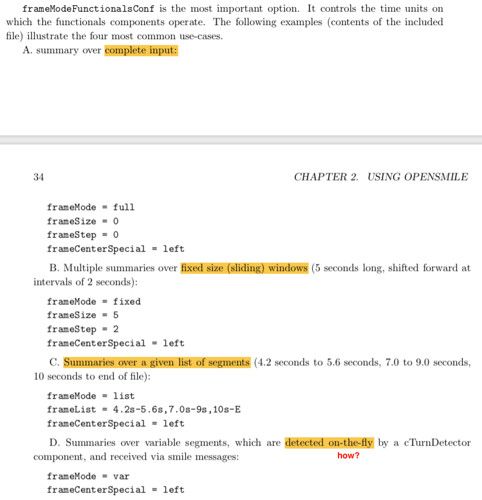

# **OpenSMILE and Feature Extraction Notes**
Authors: Haard Shah, Deborah Santo

**TODOs:**
- *Add Debbie's notes*


>OpenSMILE toolkit - Open-Source Media Interpretation by Large feature-space Extraction
>- Modular and flexible feature extractor for signal processing and machine learning applications

>*Open-source licence* - for private, research, and educational **NOT commercial**
>- BUT requires commercial development license to commercialize

> Installation creates `SMILExtract` executable in local dir and installation location

> *Note: appendix-like terminal printouts at the end*

## **Table of contents**
- [First Run](#first-run)
- [Comparing Signals](#comparing-signals)
- [Config Files](#config-files)
- [Appendix](#appendix)
	- [All available components](#all-available-components)
	- [SMILExtract Help](#smilextract-help)

## **First Run**
```bash
(impressionist_py3.6) haardshah~/developement/Impressionist/opensmile-2.3.0$ SMILExtract -C config/demo/demo1_energy.conf -I example-audio/media-interpretation.wav -O speech02.energy.csv
(MSG) [2] in SMILExtract : openSMILE starting!
(MSG) [2] in SMILExtract : config file is: config/demo/demo1_energy.conf
(MSG) [2] in cComponentManager : successfully registered 91 component types.
==> LEVEL 'wave'  +++  Buffersize(frames) = 88201  +++  nReaders = 1
==> LEVEL 'waveframes'  +++  Buffersize(frames) = 3  +++  nReaders = 1
==> LEVEL 'energy'  +++  Buffersize(frames) = 3  +++  nReaders = 1
(MSG) [2] in cComponentManager : successfully finished createInstances
									(4 component instances were finalised, 1 data memories were finalised)
(MSG) [2] in cComponentManager : starting single thread processing loop
(MSG) [2] in cComponentManager : Processing finished! System ran for 526 ticks.
```

## **Comparing Signals**
- [Stackoverflow](https://stackoverflow.com/a/20672356)
	- time doman analysis : how visually similar are signals
	- frequency or time-frequency analysis : how similar audio signals sound
	- signal variance : for noise measure
	- See link ^ for matlab code for the following
		- Similarity in time domain (static): *Multiply in place and sum*.
		- Similarity in time domain (with shift): Take *fft* of each signal, *multiply*, and *ifft*. (I believe this equivalent to matlab's xcorr.)
		- Similarity in frequency domain (static): Take *fft* of each signal, *multiply*, and *sum*.
		- Similarity in frequency domain (with shift): *Multiply the two signals and take fft*. This will show if the signals share similar spectral shapes.
		- Similarity in energy (or power if different lengths): *Square the two signals and sum each* (and divide by signal length for power). (Since the signals were detrended, this should be *signal variance*.) Then subtract and take absolute value for a measure of signal variance similarity
- [Pearson correlation coefficient](https://dsp.stackexchange.com/questions/9491/normalized-square-error-vs-pearson-correlation-as-similarity-measures-of-two-sig/9492#9492)
	> Summarizing, in general the Pearson correlation coefficient gives you a better idea of the similarity of two signals. 
- [Audio signal comparison for automatic singing evaluation](https://dsp.stackexchange.com/questions/2556/audio-signal-comparison-for-automatic-singing-evaluation/2559#2559)
- Further research [Hot answers `waveform-similarity`](https://dsp.stackexchange.com/tags/waveform-similarity/hot)

- [Audio signals: Comparison (medium)](https://medium.com/@shivama205/audio-signals-comparison-23e431ed2207)
	- Uses [Chroma print](https://oxygene.sk/2011/01/how-does-chromaprint-work/) to generate audio fingerprint

- [Algorithm for voice comparison (stackoverflow)](https://stackoverflow.com/a/2809283/7303112)
	


## **Config files**
Outline:
- [Generate Configs](#generate-configs)
- [Section Headers](#section-headers)
- [Component Connections](#component-connections)
- [Section 2.4](#section-24) - Inside OpenSMILE
- [2.4.1 Buffers](#241-buffers)
- [2.4.3 OpenSMILE terminology](#243-opensmile-terminology)
- [Section 2.5 Default feature sets](#section-25-default-feature-sets)
- [2.5.1 Available options for audio input for all standard config files](#251-available-options-for-audio-input-for-all-standard-config-files)
- [Prosodic features](#prosodic-features)
- [Chroma features](#chroma-features)
- [What are chroma features?](#what-are-chroma-features?)
- [MFCC features](#mfcc-features)
- [PLP features](#plp-features)

### **Generate Configs** 
- Generate config files
```bash
SMILExtract -cfgFileTemplate -configDflt cWaveSource,cFramer,cEnergy,cCsvSink -l 1 2> haardconfigs/mydemo.conf
```

### **Section Headers**
- `[instanceName:componentName]`


### **Component Connections**
- Okay having some difficulty understanding this
- **How to configure component connections?**
	- assigning memory "levels" to the *dataReader* and *dataWriter* by modifying `reader.dmLevel` and `writer.dmLevel`
	- *dataReader* and *dataWriter* in each source, sink, or processing component
	- <mark>Section 2.3</mark>: Basics of how to configure openSMILE
- UP NEXT
	- **2.5**
	- *standard baseling feature sets of international research competitions*
	- also explains cmdline options that the standard feature set configuration files all provide and that can be used to influence parameters of hte data input and output
	- **4.2 - 4.3**: to explore full potential of openSMILE
	- *4.2* description of the format
	- *4.3* detailed function and configuration options of all components

### **Section 2.4**

> what is going on inside openSMILE, which components exist besides those which are instantiable and connectable via the configuration files, and to learn more about the terminology used.

- OpenSmILE split into 3 phases 
	- Pre-config phase
		- cmdline options read and config file parsed
	- Configuration phase
		- 
	- Execution phase
		- tick-loop
		- each component has a `tick()` method
		- 
### **2.4.1 Buffers**
	- buffers: *ring-buffer* or *non-ring buffer*
	- if you use non-ring buffers, or if you want to process the full input (e.g. for functionals of the complete input, or mean normalization) use dynamically growing non-ring buffer level (see `cDataWriter` configuration for details)
- 2.4.2 (not documented yet)
	- look at `doc/developer/messages.txt`
	- `smileComponent.hpp` source file for structural definition of smile messages
### **2.4.3 OpenSMILE terminology**
	- *frames*: are an example sample at a timestamp
		- for a <nFields x nTimestamps> matrix, frames would refer to columns
			- *windows* or *contours* correspond to rows of this matrix
		- for exported data files, matrix is transposed, so *fields* are rows here
			- *windows* or *contours* would be columns here
	- *elements* refers to actual elements of frame/vectors
	- *field*: group of elements that belong together logically and where all elements have the same name

### **Section 2.5 Default feature sets**

> For common tasks from Music Information Retrieval and Speech Recognition fields we provide some example configuration files in the `config/` directory

- **TODO:** Lookup first information about the following feature sets
	- 

### **2.5.1 Available options for audio input for all standard config files**
<p align="center">

- **-frameModeFunctionalsConf** option to include and four most common use-cases:
<p align="center">

- **bufferMode** configuration
	- *imp: buffer size configured must be compatible with the frameMode setting in frameModeFunctionalsConf*
	- REVIEW <mark>page 34</mark> again

- Page 35 - **output data formats** for the features pulled out 

### **Prosodic features** 
1. `config/prosodyAcf.conf` and 
2. `config/prosodyShs.conf`
- They extract:
	- fundamental frequency (F0)? - 
	- voicing probability - 
	- loudness contours - 
- **default output** - CSV 
- Command
```
SMILExtract -C config/prosodyShs.conf -I input.wav -O prosody.csv
```
- `1` uses `cPitchACF` component
	- extracts `f0` via an *autocorrelation* and *cepstrum based method*
- `2` uses `cPitchShs` component
	- extracts `f0` via the *sub-harmonic sampling algorithm (SHS)*

### **Chroma features** 
- `config/chroma_fft.conf`
- command - `SMILExtract -C config/chroma_fft.conf -I input.wav -O chroma.csv`
- **output**: single line with 12 comma separated values representing mean Chroma values.

--> <mark>Resolve</mark>: prolly not a bad idea to test (question still remains, how to compare?)
#### What are chroma features?
- *Chroma features*: also *pitch class profiles* are a powerful tool for analyzing usic whose pitches can be meaningfully categorized (into 12 categories)
- they <u>capture harmonic and melodic characteristics</u> of music, while being *robust to changes in timbre and instrumentation* (do we want this?)
	- *timbre*: perceived sound quality of musical note, sound or tone (*we don't want to focus on timbre*) - so this makes sense? ***confirm with debbie***
	- *instrumentation*: combination of musical instruments employed in a composition, and properties of those instruments individually. 
	---
	- Do we want to capture <u>harmonic and melodic characteristics</u>? ***debbie?***
- Another APPLICATION: "chroma features have become de facto standard for tasks such as music alignment and synchronization as well as audio structure analysis." --> *Could we align user's dialogue with actor's dialgue?*

### **MFCC features** 
- MFCC - Mel-frequency cepstral coefficient
- Config files
	- `MFCC12_0_D_A.conf`
	- `MFCC12_E_D_A.conf`
	- `MFCC12_0_D_A_Z.conf`
	- `MFCC12_E_D_A_Z.conf`
- Command
```bash
SMILExtract -C config/MFCC12_E_D_A.conf -I input.wav -O output.mfcc.htk
```
- Output file format: HTK paramater file format (?)

--> <mark>Resolve</mark>: seems helpful in determining prosodic aspects + might help us learn user's voice (timber) for personalization (more custom feature - DREAM BIG)

- MFCCs are commonly used as feature in speech recognition systems
- MFCCs make up an MFC (Mel-frequency cepstrum)
	- *Mel-freq cepstrum* is a representation of the short-term <u>power spectrum</u> of a sound, based on linear cosine transform of a log power spectrum on a nonlinear *mel-scale* of frequency
		- *Mel-scale*: perceptual scale of pitches judged by listeners to be equal in distance from one another
	- *cepstrum* result of taking the inverse Fourier transform (IFT) of the logarithm of estimated *spectrum* of a signal.
		- "Cepstrum pitch determination is particularly effective because the effects of the voical excitation (pitch) and vocal tract (*formants*) are additive in the logarithm of the power spectrum and thus clearly separate" (*what does this mean? - pitch and formants can be separated from log of power spectrum to detection*)
		- *formants*: each of several prominent bands of frequency that determine the phonetic quality of a vowel
		- 4 different sepstrums ("<u>**power sepstrum**</u> has applications in analysis of human speech)
	- *spectrum* "any waveform can be represented by a summation of a (possibly infinite) number of sinusoids, each with a particular amplitude and phase. This representation is referred to as the *signal's spectrum* (or it's frequency-domain representation)" [Signal Spectra](https://www.music.mcgill.ca/~gary/307/week1/spectra.html)
> The cepstrum is a representation used in homomorphic signal processing, to convert signals combined by convolution (such as a source and filter) into sums of their cepstra, for linear separation. In particular, the <u>*power cepstrum*</u> is often used as a feature vector for representing the human voice and musical signals. For these applications, the spectrum is usually first transformed using the mel scale. The result is called the mel-frequency cepstrum or MFC (its coefficients are called mel-frequency cepstral coefficients, or MFCCs). It is used for voice identification, pitch detection and much more. The cepstrum is useful in these applications because the low-frequency periodic excitation from the vocal cords and the formant filtering of the vocal tract, which convolve in the time domain and multiply in the frequency domain, are additive and in different regions in the quefrency domain.
- **Not noise sensitive** - therefore common to normalize their values in speech recognition systems

### **PLP features**
- PLP : perceptual linear predictive
- [Techniques for speaker-independent automatic-speech recognition](plp-paper.pdf)
> PLP analysis is computationally efficient and yields a low-dimentional representation of speech.
> These properties are found to be useful in *speaker-independent automatic-speech recognition*.
- PLP and [Perceptual filtering](https://www.vocal.com/perceptual-filtering/)
- Could be used to improve performace of speech recognition and reduce computational load

## **High level feature ideas / thoughts**
- To make this highly interactive 
	- the front has to be slick
	- the video should scrub seemlessly (if animated, it should be smooth)
	- messaged (feedback about performance or program function messages or directions) should be highly personalized and specific. Not general and useless.
- Implement sophisticated failsafe option 
	- meaning *if user is saying it right but we can't see that*
	- display personalized messages for special events with special back-end checking
	- scenarios
		- *if user performed well but the scored don't reflect that*
			- "don't think the scores judging properly? - report it!" OR under the score, have a button that says, "I actually did well!"
			- *back-end* maybe check for inconsistency between various different feature similarities before even giving that option. OR always give that option but check for inconsistency among different feature similarities before using the feedback
		- *when the scores are good but the user didn't actually do* 
			- Button "I actually don't think I did that well."
			- *back-end* this might mean that more than necessary weight given to a feature that was compared. Readjust the weights.
				- *If it's a personalized neural net, for this and above scenario, manually or some other way label these to be used for training*
		- *user is happy with scores they're getting*
		- *user's hate the scoring*
			- ask for text feedback
			


# Appendix

## All Available Components 
```bash
$ SMILExtract -L
# for specific component help:
$ SMILExtract -H cMyComponentName
```
```bash
(MSG) [2] in SMILExtract : openSMILE starting!
(MSG) [2] in SMILExtract : config file is: smile.conf
(MSG) [2] in cComponentManager : successfully registered 91 component types.
==> The following 91 components are currently registered in openSMILE:

 +++ 'cDataMemory' +++
   central data memory component

 +++ 'cDataSelector' +++
   This component copies data from one level to another, thereby selecting frame fields and elements by their element/field name.

 +++ 'cVectorProcessor' +++
   dataProcessor, where each array field is processed individually as a vector

 +++ 'cVectorTransform' +++
   this is a base class for vector transforms which require history data or precomputed data (e.g. cepstral mean subtraction, etc.)

 +++ 'cWindowProcessor' +++
   filter dataProcessor, filters each element in a dataMemory level independently

 +++ 'cWinToVecProcessor' +++
   reads input windows, outputs frame(s)

 +++ 'cVecToWinProcessor' +++
   Base class: reads in frames , outputs windows

 +++ 'cExampleSource' +++
   This is an example of a cDataSource descendant. It writes random data to the data memory. This component is intended as a template for developers.

 +++ 'cExampleSink' +++
   This is an example of a cDataSink descendant. It reads data from the data memory and prints it to the console. This component is intended as a template for developers.

 +++ 'cSimpleMessageSender' +++
   This is an example of a cDataSink descendant. It reads data from the data memory and prints it to the console. This component is intended as a template for developers.

 +++ 'cVectorConcat' +++
   concatenates vectors from multiple levels and copy to another level

 +++ 'cFramer' +++
   This component creates frames from single dimensional input stream. It is possible to specify the frame step and frame size independently, thus allowing for overlapping frames or non continuous frames.

 +++ 'cWindower' +++
   This component applies applies window function to pcm frames.

 +++ 'cVectorOperation' +++
   This component performs elementary operations on vectors (i.e. basically everything that does not require history or context, everything that can be performed on single vectors w/o external data (except for constant parameters, etc.))

 +++ 'cValbasedSelector' +++
   This component copies only those frames from the input to the output that match a certain threshold criterion, i.e. where a specified value N exceeds a certain threshold.

 +++ 'cMaxIndex' +++
   This component computes the indices of the features with the maximum absolute values per frame.

 +++ 'cFullinputMean' +++
   This component performs mean normalizing on a data series. A 2-pass analysis of the data is performed, which makes this component unusable for on-line analysis. In the first pass, no output is produced and the mean value (over time) is computed for each input element. In the second pass the mean vector is subtracted from all input frames, and the result is written to the output dataMemory level. Attention: Due to the 2-pass processing the input level must be large enough to hold the whole data sequence.

 +++ 'cFullturnMean' +++
   This component performs mean normalizing on a data series. A 2-pass analysis of the data is performed, which makes this component unusable for on-line analysis. In the first pass, no output is produced and the mean value (over time) is computed for each input element. In the second pass the mean vector is subtracted from all input frames, and the result is written to the output dataMemory level. Attention: Due to the 2-pass processing the input level must be large enough to hold the whole data sequence.

 +++ 'cWaveSource' +++
   This component reads an uncompressed RIFF (PCM-WAVE) file and saves it as a stream to the data memory. For most feature extraction tasks you will now require a cFramer component.

 +++ 'cArffSource' +++
   This component reads WEKA ARFF files. The full ARFF format is not yet supported, but a simplified form, such as the files generated by the cArffSink component can be parsed and read. This component reads all (and only!!) 'numeric' or 'real' attributes from an ARFF file (WEKA file format) into the specified data memory level. Thereby each instance (i.e. one line in the arff file\'s data section) corresponds to one frame. The frame period is 0 by default (aperiodic level), use the 'period' option to change this and use a fixed period for each frame/instance. Automatic generation of frame timestamps from a 'timestamp' field in the Arff file is not yet supported.

 +++ 'cCsvSource' +++
   This component reads CSV (Comma seperated value) files. It reads all columns as attributes into the data memory. One line represents one frame. The first line may contain a header with the feature names (see header=yes/no/auto option).

 +++ 'cHtkSource' +++
   This component reads data from binary HTK parameter files.

 +++ 'cNullSink' +++
   This component reads data vectors from the data memory and 'destroys' them, i.e. does not write them anywhere. This component has no configuration options.

 +++ 'cCsvSink' +++
   This component exports data in CSV (comma-separated-value) format used in many spreadsheet applications. As the first line of the CSV file a header line may be printed, which contains a delimiter separated list of field names of the output values.

 +++ 'cDatadumpSink' +++
   This component writes dataMemory data to a raw binary file (e.g. for matlab import). The binary file consits of 32-bit float values representing the data values, concattenated frame by frame along the time axis. The first two float values in the file resemble the file header, an thus indicate the dimension of the matrix (1: size of frames, 2: number of frames in file). The total file size in bytes is thus <size of frames>x<number of frames>x4 + 2.

 +++ 'cArffSink' +++
   This component writes dataMemory data to an ARFF file (WEKA). Depending on your config an instance name field, a frame index, and a frame time field can be added as well as multiple class/target attributes. See the config type documentation for more details.

 +++ 'cHtkSink' +++
   This component writes dataMemory data to a binary HTK parameter file.

 +++ 'cWaveSink' +++
   This component saves data to an uncompressed PCM WAVE file

 +++ 'cWaveSinkCut' +++
   This component writes data to uncompressed PCM WAVE files. Only chunks, based on timings received via smile messages are written to files. The files may have consecutive numbers appended to the file name.

 +++ 'cBowProducer' +++
   This component produces a bag-of-words vector from the keyword spotter result message.

 +++ 'cSignalGenerator' +++
   This component provides a signal source. This source generates various noise types and pre-defined signals and value patterns. See the configuration documentation for a list of currently implemented types.

 +++ 'cMonoMixdown' +++
   This is a simple mixer, which adds multiple channels (elements) to a single channel (element).

 +++ 'cTransformFFT' +++
   This component performs an FFT on a sequence of real values (one frame), the output is the complex domain result of the transform. Use the cFFTmagphase component to compute magnitudes and phases from the complex output.

 +++ 'cFFTmagphase' +++
   This component computes magnitude and phase of each array in the input level (it thereby assumes that the arrays contain complex numbers with real and imaginary parts alternating, as computed by the cTransformFFT component).

 +++ 'cAmdf' +++
   This component computes the Average Magnitude Difference Function (AMDF) for each input frame. Various methods for padding or warping at the border exist.

 +++ 'cAcf' +++
   This component computes the autocorrelation function (ACF) by sqauring a magnitude spectrum and applying an inverse Fast Fourier Transform. This component mus read from a level containing *only* FFT magnitudes in a single field. Use the 'cTransformFFT' and 'cFFTmagphase' components to compute the magnitude spectrum from PCM frames. Computation of the Cepstrum is also supported (this applies a log() function to the magnitude spectra).

 +++ 'cPreemphasis' +++
   This component performs pre- and de-emphasis of speech signals using a 1st order difference equation: y(t) = x(t) - k*x(t-1)  (de-emphasis: y(t) = x(t) + k*x(t-1))

 +++ 'cVectorPreemphasis' +++
   This component performs per frame pre-emphasis without an inter-frame state memory. (This is the way HTK does pre-emphasis). Pre-emphasis: y(t) = x(t) - k*x(t-1) ; de-emphasis : y(t) = x(t) + k*x(t-1)

 +++ 'cVectorMVN' +++
   This component extends the base class cVectorTransform and implements mean/variance normalisation. You can use this component to perform on-line cepstral mean normalisation. See cFullinputMean for off-line cepstral mean normalisation.

 +++ 'cTurnDetector' +++
   Speaker turn detector using data from cVadV1 component or cSemaineSpeakerID1 (adaptive VAD) to determine speaker turns and identify continuous segments of voice activity.

 +++ 'cDeltaRegression' +++
   This component computes delta regression coefficients using the regression equation from the HTK book.

 +++ 'cContourSmoother' +++
   This component smooths data contours by applying a moving average filter of configurable length.

 +++ 'cSmileResample' +++
   This component implements a spectral domain resampling component. Input frames are transferred to the spectral domain, then the spectra are shifted, and a modified DFT is performed to synthesize samples at the new rate.

 +++ 'cSpecResample' +++
   This component implements a spectral domain resampling component. Input frames are complex valued spectral domain data, which will be shifted and scaled by this component, and a modified DFT is performed to synthesize samples at the new rate.

 +++ 'cDbA' +++
   This component performs dbX (dbA,dbB,dbC,...) equal loudness weighting of FFT bin magnitudes. Currently only dbA weighting is implemented.

 +++ 'cVadV1' +++
   A voice activity detector based on Line-Spectral-Frequencies, Mel spectra and energy + smoothing. This component requires input of the following type in the following order: MelSpec;lsf;energy. See vadV1.hpp for an example config!

 +++ 'cSpecScale' +++
   This component performs linear/non-linear axis scaling of FFT magnitude spectra with spline interpolation.

 +++ 'cMZcr' +++
   This component computes time signal properties, zero-corssing rate, mean-crossing rate, dc offset, max/min value, and absolute maximum value of a PCM frame.

 +++ 'cEnergy' +++
   This component computes logarithmic (log) and root-mean-square (rms) signal energy from PCM frames.

 +++ 'cIntensity' +++
   This component computes simplified frame intensity (narrow band approximation). IMPORTANT: It expects UNwindowed raw PCM frames as input!! A Hamming window is internally applied and the resulting signal is squared bevore applying loudness compression, etc.

 +++ 'cMelspec' +++
   This component computes an N-band Mel/Bark/Semitone-frequency spectrum (critical band spectrum) by applying overlapping triangular filters equidistant on the Mel/Bark/Semitone-frequency scale to an FFT magnitude or power spectrum.

 +++ 'cMfcc' +++
   This component computes Mel-frequency cepstral coefficients (MFCC) from a critical band spectrum (see 'cMelspec'). An I-DCT of type-II is used from transformation from the spectral to the cepstral domain. Liftering of cepstral coefficients is supported. HTK compatible values can be computed.

 +++ 'cPlp' +++
   This component computes PLP and RASTA-PLP (currently the RASTA filter is not yet implemented) cepstral coefficients from a critical band spectrum (generated by the cMelspec component, for example).
   The component is capable of performing the following processing steps: 
   1) Take the natural logarithm of the critical band powers (doLog)
   2) RASTA filtering
   3) Computation of auditory spectrum (equal loudness curve and loudness compression)
   4) Inverse of the natural logarithm
   5) Inverse DFT to obtain autocorrelation coefficients
   6) Linear prediction analysis on autocorr. coeff.
   7) Computation of cepstral coefficients from lp coefficients
   8) Cepstral 'liftering'

 +++ 'cSpectral' +++
   This component computes spectral features such as flux, roll-off, centroid, and user defined band energies (rectangular summation of FFT magnitudes), etc.

 +++ 'cPitchACF' +++
   This component computes the fundamental frequency and the probability of voicing via an acf and cepstrum based method. The input must be an acf field and a cepstrum field (both generated by a cAcf component).

 +++ 'cPitchSmoother' +++
   This component performs temporal pitch smoothing. Input: candidates produced by a pitchBase descendant (e.g. cPitchSHS). The voicing cutoff threshold is inherited from the input component, thus this smoother component does not provide its own threshold option.

 +++ 'cTonespec' +++
   This component computes (or rather estimates) a semi-tone spectrum from an FFT magnitude spectrum.

 +++ 'cTonefilt' +++
   This component implements an on-line, sample by sample semi-tone filter bank which can be used as first step for the computation of CHROMA features as a replacement of cTonespec. The filter is based on correlating with a sine wave of the exact target frequency of a semi-tone for each note in the filter-bank.

 +++ 'cChroma' +++
   This component computes CHROMA features from a semi-tone scaled spectrum generated by the 'cTonespec' component.

 +++ 'cCens' +++
   This component computes CENS (energy normalised and smoothed chroma features) from raw Chroma features generated by the 'cChroma' component.

 +++ 'cHarmonics' +++
   This component computes statistics of F0 harmonics. It requires an F0 (Hertz) input field and a linear frequency axis magnitude spectrum as input.

 +++ 'cPitchSmootherViterbi' +++
   Viterbi algorithm to smooth pitch contours and remove octave jumps.

 +++ 'cPitchJitter' +++
   This component computes Voice Quality parameters Jitter (pitch period deviations) and Shimmer (pitch period amplitude deviations). It requires the raw PCM frames and the corresponding fundamental frequency (F0) as inputs.

 +++ 'cPitchDirection' +++
   This component reads pitch data, detects pseudo syllables, and computes pitch direction estimates per syllable. Thereby the classes falling, flat, and rising are distinguished. 
    Required input fields: F0, F0env, and 'loudness' or 'RMSenergy'.

 +++ 'cPitchShs' +++
   This component computes the fundamental frequency via the Sub-Harmonic-Sampling (SHS) method (this is related to the Harmonic Product Spectrum method).

 +++ 'cLpc' +++
   This component computes linear predictive coding (LPC) coefficients from PCM frames. Burg\'s algorithm and the standard ACF/Durbin based method are implemented for LPC coefficient computation. The output of LPC filter coefficients, reflection coefficients, residual signal, and LP spectrum is supported.

 +++ 'cLsp' +++
   This component computes LSP (line spectral pair frequencies, also known as LSF) from LPC coefficients by partial factorisation of the LPC polynomial.

 +++ 'cFormantLpc' +++
   This component computes formant frequencies and bandwidths by solving for the roots of the LPC polynomial. The formant trajectories can and should be smoothed by the cFormantSmoother component.

 +++ 'cFormantSmoother' +++
   This component performs temporal formant smoothing. Input: candidates produced by a formant** component AND(!) - appended - an F0final or voicing field (which is 0 for unvoiced frames and non-zero for voiced frames). Output: Smoothed formant frequency contours.

 +++ 'cFunctionals' +++
   computes functionals from input frames, this component uses various cFunctionalXXXX sub-components, which implement the actual functionality

 +++ 'cLibsvmSink' +++
   This component writes data to a text file in LibSVM feature file format. For the 'on-the-fly' classification component see 'cLibsvmliveSink'.
```

## SMILExtract Help 
```bash
$ SMILExtract -h
```
```bash
 =============================================================== 
   openSMILE version 2.3.0 (Rev. 2014:2043)
   Build date: Feb 12 2019 (UNKNOWN-BUILD-DATE)
   Build branch: 'opensmile-2.3.0'
   (c) 2014-2016 by audEERING GmbH
   All rights reserved. See the file COPYING for license terms.
   Lead author: Florian Eyben
 =============================================================== 
 
Usage: SMILExtract [-option (value)] ...
 
 -h    Show this usage information
 
 -C, -configfile  	 <string>
	 Path to openSMILE config file
	 {{ default = 'smile.conf' }}
 
 -l, -loglevel  	 <integer value>
	 Verbosity level (0-9)
	 {{ default = 2 }}
 
 -t, -nticks  	 <integer value>
	 Number of ticks to process (-1 = infinite) (only works for single thread processing, i.e. nThreads=1)
	 {{ default = -1 }}
 
 -L, -components  	 [boolean 0/1]
	 Show component list
	 {{ default = 0 }}
 
 -H, -configHelp  	 [string]
	 Show documentation of registered config types (on/off/argument) (if an argument is given, show only documentation for config types beginning with the name given in the argument)
	 {{ default = '(null)' }}
 
 -configDflt      	 [string]
	 Show default config section templates for each config type (on/off/argument) (if an argument is given, show only documentation for config types beginning with the name given in the argument, OR for a list of components in conjunctions with the 'cfgFileTemplate' option enabled)
	 {{ default = '(null)' }}
 
 -cfgFileTemplate      	 [boolean 0/1]
	 Print a complete template config file for a configuration containing the components specified in a comma separated string as argument to the 'configDflt' option
	 {{ default = 0 }}
 
 -cfgFileDescriptions      	 [boolean 0/1]
	 Include description in config file templates.
	 {{ default = 0 }}
 
 -c, -ccmdHelp  	 [boolean 0/1]
	 Show custom commandline option help (those specified in config file)
	 {{ default = 0 }}
 
 -logfile      	 <string>
	 set log file
	 {{ default = 'smile.log' }}
 
 -nologfile      	 [boolean 0/1]
	 don't write to a log file (e.g. on a read-only filesystem)
	 {{ default = 0 }}
 
 -noconsoleoutput      	 [boolean 0/1]
	 don't output any messages to the console (log file is not affected by this option)
	 {{ default = 0 }}
 
 -appendLogfile      	 [boolean 0/1]
	 append log messages to an existing logfile instead of overwriting the logfile at every start
	 {{ default = 0 }}
```

